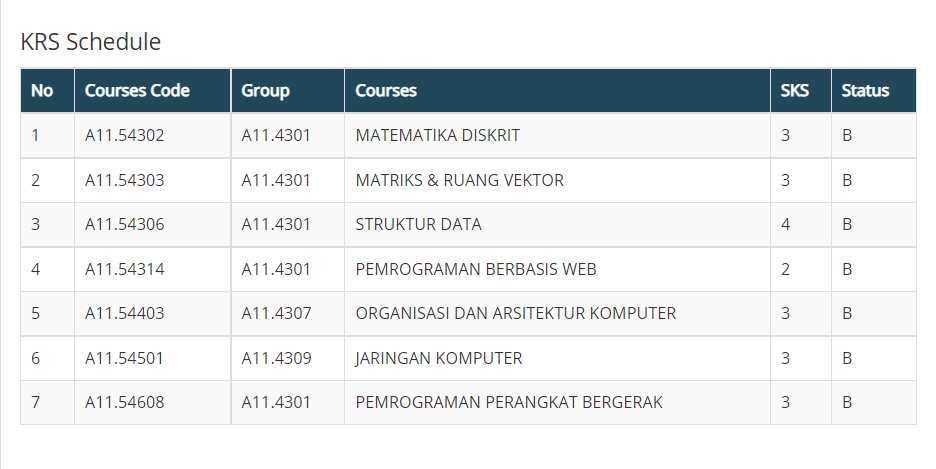

<!DOCTYPE html>
<html>
<head>
<title>BIODATA DIRI</title>
</head>
<body>
<h1 align="left">Pemrograman Web</h1>
 

 
<h1 align="left">BIODATA DIRI</h1>
<table width="745" border="1" cellspacing="0" cellpadding="5" align="bottom">
<tr align="center" bgcolor="#008080">
<td width="174">DATA DIRI</td>
<td width="353">KETERANGAN</td>
<td width+"200">FOTO</td>
</tr>
<tr>
<td>Nama Lengkap</td>
<td>Rizki Rafi Fidityo</td>
<td rowspan="10" align="center">
</tr>
<tr>
<td>Tempat, Tanggal Lahir</td>
<td>Semarang, 11 September 2002</td>
</tr>
<tr>
<td>Jenis Kelamin</td>
<td>Laki-Laki</td>
</tr>
<tr>
<td>Golongan Darah</td>
<td>AB</td>
</tr>
<tr>
<td>Agama</td>
<td>Islam</td>
</tr>
<tr>
<td>Alamat</td>
<td>Jl. Singa Utara Perum BPD II No.10</td>
</tr>
</table>
<tr>
</tr>
</body>
<body>
    

  </body>
</html>
